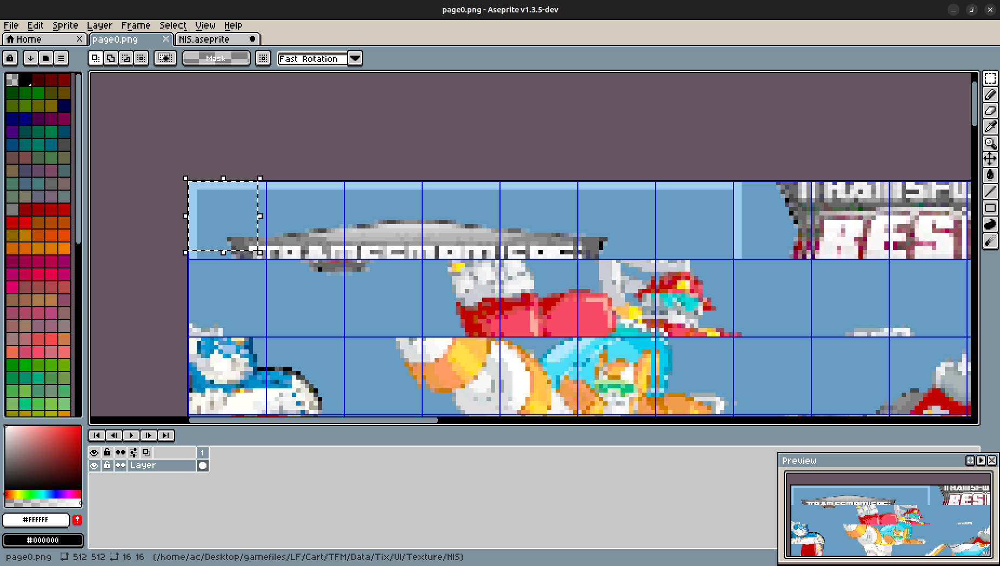

# LeapNotes
These are some notes on my experience from ripping from silly LeapFrog products.

## Breaking in
So, you may wonder *how* exactly we get any sort of asset from the LeapPad. Well, first we use something called [LeapPad Manager](https://web.archive.org/web/20210507031610/https://spiffyhacks.com/uploads/leappad-manager.zip) to actually connect to the LeapPad and turn on 'developer mode' as per [The Cutting Room Floor](https://tcrf.net/LeapPad_Explorer#Developer_Mode). It seems that you can also set up developer mode on a Linux host as per [Clayton Carter](https://gist.github.com/claytonrcarter/847fe44f5a5066ce6a1e33524740b037) but I haven't used that method to set the LeapPad into developer mode, only to setup the FTP interface.

## Getting the files
At that point I used the details from the aforementioned guide from Clayton Carter, but instead of connecting via the command line, you can connect via your file manager. There should be an option like 'Connect to Server', but you may need to look around. In GNOME Files, you'd go to 'Other Locations' and type `ftp://192.168.0.111` at the bottom. The LeapPad is always at this IP address. However, it will only expect an IP address from 192.168.0.xxx, so we have to set the IP to `192.168.0.1` for this to work. The username is `root` and there isn't a password. Most of the files will be stored under the `LF` folder, but some files may be stored in other places, i.e. `/var`.

## Ripping sounds from games
Sounds will be stored in one of three formats, or even redundantly duplicated in one of them. They'll either be an MP3 file, an Ogg Vorbis file, or an ADPCM-flavoured WAV file.

## Ripping UDI images (developed by LeapFrog)
This is a bit of an interesting process which will require various tools. A big thank you to the folks over on the [ResHax forums](https://reshax.com/topic/588-leapfrog-udi-files/) for helping me solve this! For the actual rips, I used Luigi Auriemma's [OffZip](https://aluigi.altervista.org/mytoolz.htm) to get the image data, [TextureFinder](https://reshax.com/files/file/26-texturefinder/) to figure out the pixel format, [PVRTexTool](https://developer.imaginationtech.com/pvrtextool/) from Imagination Technologies to export said image data into a .png and [Aseprite (paid, but free source code)](https://aseprite.org/) to wrangle the tiles into an actual image. [ImHex](https://imhex.werwolv.net) was also used to check the bytes in the .udi that set the dimensions, with two uint16 bytes at 0x00000010 and 0x00000012 to set the width and height respectively. The image is stored in RGBA4444 format in 18x18 pixel tiles, with the rightmost two columns and bottom two rows containing redundant information. Basically, you can select 16x16 pixels from the top left and tile them to create the images that are used. Here's an example from Aseprite:


## Other Ocean Interactive/LeapFrog data.arc
This one was ripped with some more [ResHax help](https://reshax.com/topic/592-leapfrog-arc-file/?do=findComment&comment=2336&_rid=1978). Special thanks to BloodRaynare who created this [QuickBMS](https://aluigi.altervista.org/quickbms.htm) script:
```
## My Little Pony: Friendship is Magic (LeapFrog) - data.arc extraction script by BloodRaynare
## For use with QuickBMS

comtype msf

get TOC_SZ long
get TOC_ZSZ long
savepos TMP
log MEMORY_FILE 0 0
clog MEMORY_FILE TMP TOC_ZSZ TOC_SZ
xmath BASE_OFF "TMP + TOC_ZSZ"

for i = 0
	savepos TOC_POS MEMORY_FILE
	if TOC_POS >= TOC_SZ
		break
	endif
	get NAME string MEMORY_FILE
	get OFFSET long MEMORY_FILE
	get SIZE long MEMORY_FILE
	math OFFSET + BASE_OFF
	putarray 0 i NAME OFFSET SIZE
next i
math FILES = i

get ARC_SZ asize

for i = 0 < FILES
	getarray NAME OFFSET SIZE 0 i
	math i + 1
	if i == FILES
		xmath ZSIZE "ARC_SZ - OFFSET"
	else
		getarray NEXT_OFFSET 1 i
		xmath ZSIZE "NEXT_OFFSET - OFFSET"
	endif
	if ZSIZE == SIZE
		log NAME OFFSET SIZE
	else
		clog NAME OFFSET ZSIZE SIZE
	endif
next
```

## Ripping Other Ocean Interactive .oot files
The header for these files are 64 bytes long. The image itself is stored as a raw image in either RGBA4444 or RGB565 format. 
